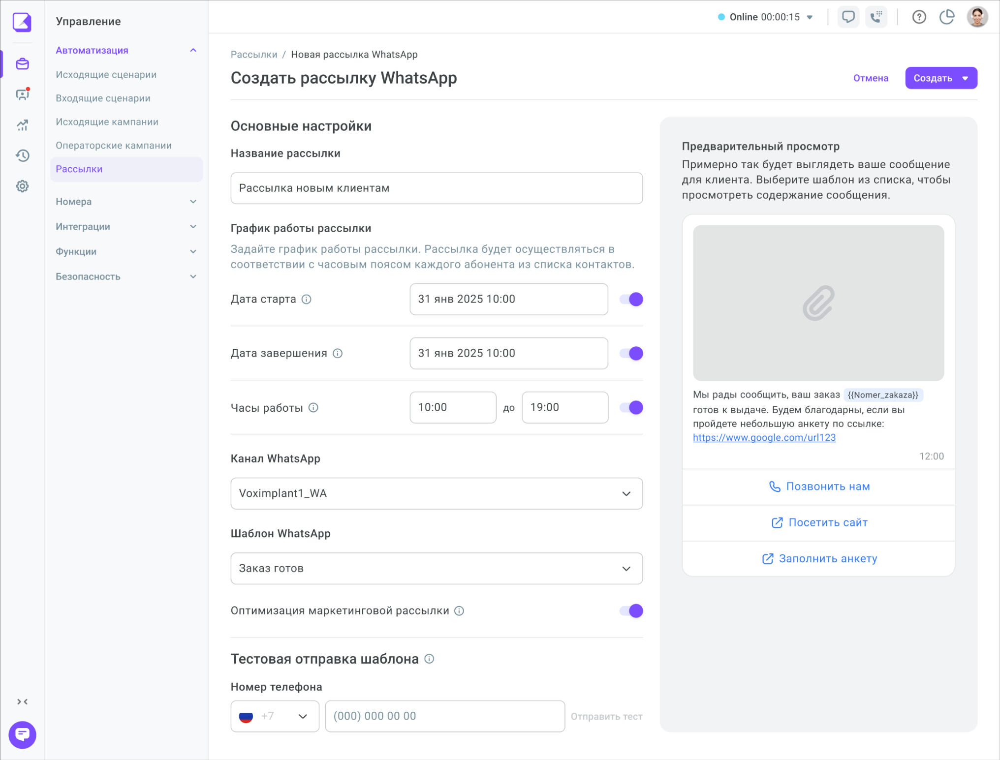
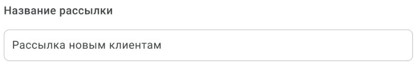
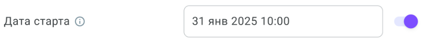
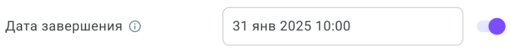
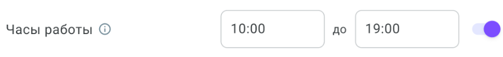
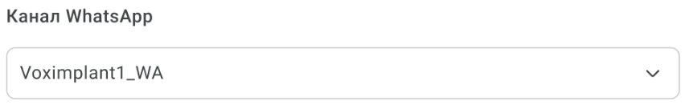
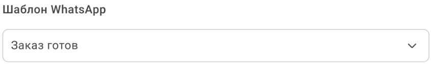
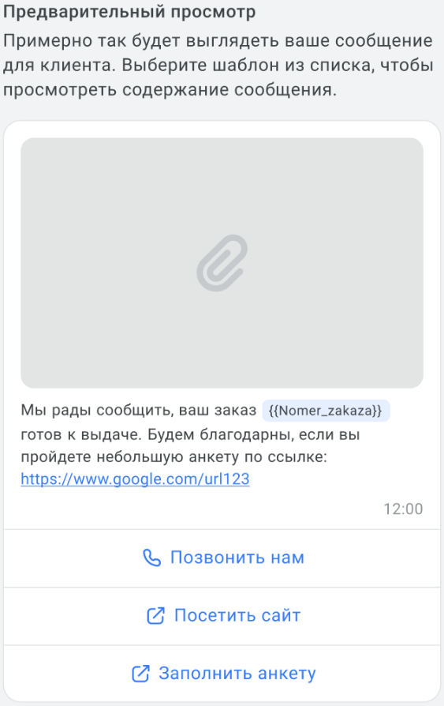
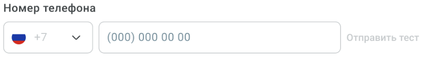
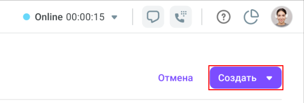

= Создание WhatsApp-рассылки
:toc:
:toc-title: Содержание
:toclevels: 2
:page-role: whatsapp-mailing-page

include::../styles/custom-design-headings.adoc[]
include::../styles/custom-design-admonitions.adoc[]

*WhatsApp-рассылка* -- это массовая отправка сообщений клиентам через канал WhatsApp с использованием согласованного шаблона link:https://voximplant.ru/kit/docs/setup/conversations/templatecollections/whatsapptemplates[WhatsApp HSM]. С помощью WhatsApp-рассылки можно подготовить сообщение заранее, выбрать время отправки, загрузить список контактов и запустить рассылку для нужной аудитории.

[NOTE]
--
Раздел *Рассылки* доступен только если на аккаунте активирован link:https://voximplant.ru/kit/docs/setup/contactcenter[Контакт-центр]. Если Контакт-центр не активирован, то раздел *недоступен*.

Создавать WhatsApp-рассылки могут пользователи с ролями *Владелец* и *Администратор*.
--

== Перед началом работы

Перед созданием рассылки убедитесь, что выполнены следующие условия:

. На аккаунте активирован Контакт-центр.
. В разделе *Каналы* добавлен и настроен канал *WhatsApp*.
. Зарегистрирован и согласован шаблон *WhatsApp HSM*.
. У пользователя есть роль *Владелец* или *Администратор*.

Чтобы открыть страницу создания рассылки, перейдите в раздел *Управление → Автоматизация → Рассылки* и нажмите *Создать рассылку*.

[.screenshot-bordered]

== Как создать WhatsApp-рассылку

Чтобы создать WhatsApp-рассылку, выполните следующие действия:

. Перейдите в раздел *Управление → Автоматизация → Рассылки*.
. Нажмите кнопку *Создать рассылку*.
. Заполните основные параметры рассылки. Подробнее см. в разделе <<mailing_parameters,Настройка рассылки>>.
+
* *Название рассылки*.
+
[.screenshot-bordered]

* *Дата старта* (опционально), если нужно отложить запуск.
+
[.screenshot-bordered]

* *Дата завершения* (опционально), если нужно ограничить период отправки.
+
[.screenshot-bordered]

* *Часы работы* (опционально), если сообщения должны отправляться только в определенное время.
+
[.screenshot-bordered]

+
. Выберите канал *WhatsApp*.
+
[.screenshot-bordered]

. Выберите шаблон *WhatsApp HSM*.
+
[.screenshot-bordered]

. Проверьте *Предварительный просмотр* сообщения.
+
[.screenshot-bordered]

. При необходимости выполните тестовую отправку шаблона по указанному номеру телефона.
+
[.screenshot-bordered]

. Нажмите *Создать*
+
[.screenshot-bordered]

+
И в контекстном меню выберите *Создать как черновик и добавить контакты*.

. Загрузите файл с контактами.
. Сопоставьте столбцы файла с полями системы.
. Завершите загрузку файла контактов.
. Запустите рассылку через кнопку *Действия*.

После запуска рассылка отображается в общем списке со статусом *Выполняется*.

[#mailing_parameters]
== Настройка рассылки

Все отображаемые поля формы *обязательны* для заполнения. Проверка значений выполняется в реальном времени. Если переключатель параметра выключен, связанное с ним поле можно не заполнять.

=== Название рассылки

В поле *Название рассылки* укажите название, по которому вы сможете найти рассылку в общем списке.

[.screenshot-bordered]

Требования к названию:

* До 140 символов.
* Допускаются любые символы.
* Название должно быть уникальным.

=== Дата старта

Параметр *Дата старта* определяет, когда рассылка станет доступна к запуску.

[.screenshot-bordered]

* *Если переключатель выключен* -- рассылка запускается сразу после нажатия *Запустить*.
* *Если переключатель включен* -- становится доступен выбор даты и времени.

[IMPORTANT]
--
* Дата старта должна быть больше текущей даты и времени.
* Допустима установка нескольких рассылок на одно и то же время.
* Дата старта не может быть позже *31.12.2029*.
--

=== Дата завершения

Параметр *Дата завершения* определяет, когда рассылка должна завершиться.

[.screenshot-bordered]

* *Если переключатель выключен* -- рассылка завершается после отправки сообщений всем контактам.
* *Если переключатель включен* -- становится доступен выбор даты и времени завершения.

[IMPORTANT]
--
* Дата и время завершения должны быть больше текущих.
* Дата завершения не может быть позже *31.12.2029*.
--

=== Часы работы

Параметр *Часы работы* позволяет ограничить интервал, в который система отправляет сообщения.

[.screenshot-bordered]

* *Если переключатель выключен* -- сообщения отправляются без ограничений по времени.
* *Если переключатель включен* -- необходимо указать временной диапазон отправки.

Параметры:

* Время задается в формате от *00:00* до *23:59*.
* Минимальная длительность диапазона составляет 1 минуту.
* Сообщения отправляются только в пределах указанного интервала.

[NOTE]
--
В блоке *График работы рассылки* также отображается подсказка о том, что рассылка выполняется с учетом часового пояса каждого абонента из списка контактов.
--

=== Выбор канала WhatsApp

В поле *Канал WhatsApp* можно выбрать только один канал.

[.screenshot-bordered]

* *Если на аккаунте доступен только один канал* -- он подставляется автоматически.
* *Если на аккаунте доступно несколько каналов* -- выберите нужный канал из списка.
* *Если на аккаунте нет доступных каналов* -- пользователь с ролью *Владелец* или *Администратор* может перейти к созданию канала. Пользователь с ролью *Менеджер* получает уведомление о том, что нужно обратиться к администратору.

[TIP]
--
Если для канала установлен лимит отправки сообщений, то система показывает уведомление о действующем лимите.
--

=== Выбор шаблона WhatsApp HSM

В поле *Шаблон WhatsApp* можно выбрать только один согласованный шаблон.

[.screenshot-bordered]

* *Если доступен только один шаблон* -- он подставляется автоматически.
* *Если доступно несколько шаблонов* -- выберите нужный вариант из списка.
* *Если нет доступных шаблонов* -- пользователь с ролью *Владелец* или *Администратор* может нажать *Создать шаблон*. Пользователь с ролью *Менеджер* получает уведомление о том, что нужно обратиться к администратору.

После выбора шаблона в правой части страницы обновляется *Предварительный просмотр* сообщения. Если шаблон содержит файл в заголовке, то на странице появляется блок *Вложение для заголовка*.

=== Предварительный просмотр

Блок *Предварительный просмотр* находится в правой части страницы и показывает, как сообщение будет выглядеть для клиента.

[.screenshot-bordered]

С помощью этого блока можно проверить:

* Текст сообщения.
* Кнопки.
* Ссылки.
* Переменные шаблона.

Предварительный просмотр обновляется после выбора шаблона.

== Тестовая отправка

Перед запуском рассылки можно отправить тестовое сообщение.

[.screenshot-bordered]

Чтобы выполнить тестовую отправку:

. В блоке *Тестовая отправка шаблона* укажите номер телефона.
. Нажмите *Отправить тест*.
. В открывшейся боковой панели заполните переменные шаблона.
. Подтвердите отправку.

[NOTE]
--
При тестовой отправке действуют следующие правила:

* Номер телефона нужно вводить в формате региона выбранного канала.
* Кнопка *Отправить тест* становится активной только после ввода номера.
* Количество тестовых отправок не ограничено.
* Тестовая отправка доступна не только при создании, но и при редактировании рассылки.
--

Пример номера для региона *RU*: `+7 931 230-0391`.
